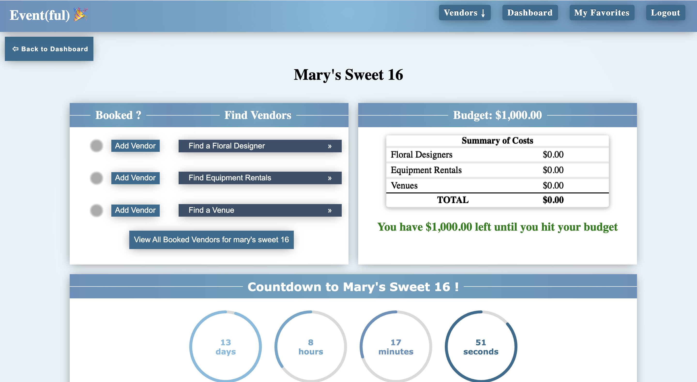
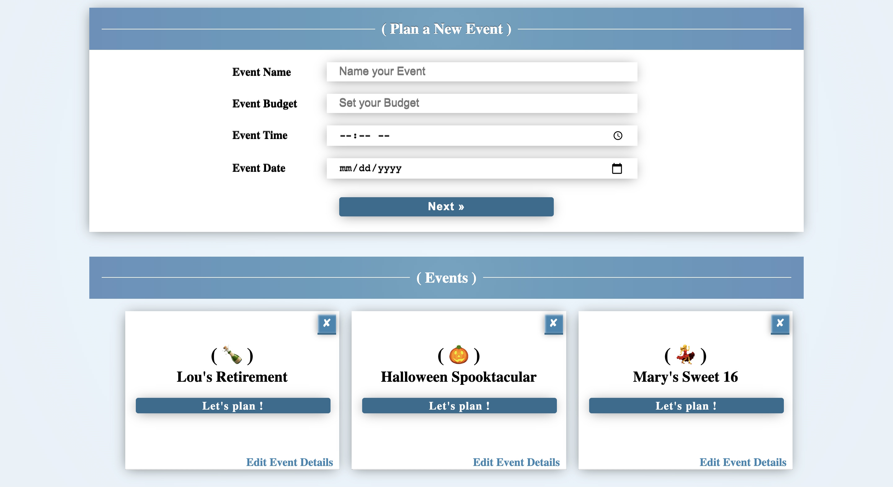

# Event(ful) 
## Full Stack Party Planning App
### Capstone Project






## Table of Content
* Overview
* Project Structure
* Usage 
* Future Implementation
<!-- * Contributors -->

## Overview
The amateur event planner doesn't have much experience finding vendors, keeping track of their vendor budget, or monitoring what vendors they like and which ones they have and haven't booked. These essential aspects of planning an event are spread out across different platforms. For example, one might use Google or Yelp to find and connect with vendors. However, there are many details to consider (catering, music, photography, etc.) when planning a party, which can lead to multiple search queries. In order to keep track of all of their booked vendor's information (contact, cost, etc.), what vendors they have and have yet to book, as well as if they are still on budget, they may use a Microsoft excel spreadsheet. But, Excel does not create organized checklists tailored to your events. Instead, you are required to create tables and populate them with information yourself. While these separate entities are okay on their own, for an individual who struggles with multitasking, it would take resiliency on their part to stay organized.
The Event(ful) App is a one-stop-shop for your vendor-booking organization. The app allows users to plan and manage an event that they are organizing.

### Features

 Users are able to:
* Create a checklist of the vendors that they need
* Find vendors based on geographic location and access their contact information
* Favorite vendors that they would like to keep in mind
* Track what vendors they still need to book vs. what vendors they have already booked
* Easily access all of their booked vendor's contact information, as well as their favorite vendor's contact information
* Monitor their budget as they book vendors

### Technology Implemented
* **Node.js** and **Express.js** for the back-end.
* **PostgreSQL** handled our database management.
* **Firebase** was used to handle user authorization.
* **React.js** was used for front-end user interaction.
* **CSS** and **Toastify** were used to style the app.

## Project Structure

```
├── README.md (what you are currently reading)
├── back-end (a basic express app)
├── front-end (a basic create-react-app)
└── package.json (necessary for heroku deployment )
```

**NOTE:** - We have 3 `package.json` files in this project

- **Top level** - necessary for heroku deployment
- **back-end** - everything to do with the express/postgres backend
- **front-end** - everything to do with the create-react-app front-end


## Usage
### Getting Started
* Fork this repo
* Clone the forked repository
* `cd` to the directory where you cloned it
* `npm install` to install dependencies

### Front-end
* open new terminal
* `cd` into directory where Event(ful) was cloned
* `cd` into front-end (Must be same level as `package.json`)
* run `npm install` to install dependencies
* run `npm start`

### Back-end
* `cd` into back-end (Must be same level as `package.json`)
* run `npm install` to install dependencies
* run `nodemon`

### Backend Routes Table 

| HTTP Method | Controller | Action | URL
| ----------- | ----------- | ----------- | ----------- |
| GET | Users | SHOW | /users |
| GET |Users | SHOW | /users/:email |
| POST | Users | CREATE | /users/ |
| GET | Events | SHOW | /events/:user_id/ |
| GET | Events | SHOW | /events/:user_id/:event_id |
| POST | Events | CREATE | /events/:user_id |
| PUT | Events | UPDATE | /events/:user_id/:event_id |
| DELETE | Events | DESTROY | /events/:user_id/:event_id|
| POST | Checklist | CREATE | /checklist/:user_id/:event_id |
| GET | Checklist | SHOW | /checklist/:user_id/:event_id |
| PUT | Checklist | UPDATE | /checklist/:user_id/:event_id |
| PUT | Checklist | UPDATE | /checklist/cost/:user_id/:event_id |
| DELETE | Checklist | DESTROY | /checklist/:user_id/:event_id/:task_name |
| DELETE | Checklist | DESTROY | /checklist/all/:user_id/:event_id |
| GET | Favorites | SHOW | /favorites/:user_id |
| GET | Favorites | SHOW | /favorites/:user_id/:event_id/:vendor_name |
| POST | Favorites| CREATE | /favorites/:user_id |
| DELETE | Favorites| DESTROY | /favorites/:user_id/:vendor_name |
| PUT |Favorites | UPDATE | /favorites/:user_id |
| GET | Booked | SHOW | /booked/:user_id/:event_id  |
| GET | Booked | SHOW | /booked/:user_id/:event_id/:vendor_name  |
| GET | Booked | SHOW | /booked/category/:category/:user_id/:event_id  |
| POST | Booked| CREATE | /booked/:user_id/:event_id |
| DELETE | Booked| DESTROY | /booked/:user_id/:event_id/:category |
| PUT | Booked | UPDATE | /booked/:user_id/:event_id |
| PUT | Booked | UPDATE | /booked/cost/:user_id/:event_id |


[Detailed Back-end Documentation](https://documenter.getpostman.com/view/16788389/UUy65PT5)

### Future Implementations
* Allow users to search for vendors without signing-in.
* Allow users to change personal settings i.e. name, password, etc. 
* Display vendor's locations in a map view.


## Acknowledgements
We would like to thank 
* our Pursuit Instructors Myra Smith and Tristan Angieri.
* our technical mentor Ferdy Budhiharma.
* our design mentor Daniela Shuffler.


<!-- 
## Contributors
* [Cassidy Beni](https://github.com/cassidybeni)
* [Angelina Ebreo](https://github.com/angelinaebreo)
* [Rayvon Finney-Pinkston](https://github.com/rayfinn55)
* [Teyanna Earle](https://github.com/teyannaearle)
* [Jasleen Villamil](https://github.com/jasleenv)
* [Raymond Udeogu](https://github.com/rayu117)
 -->
